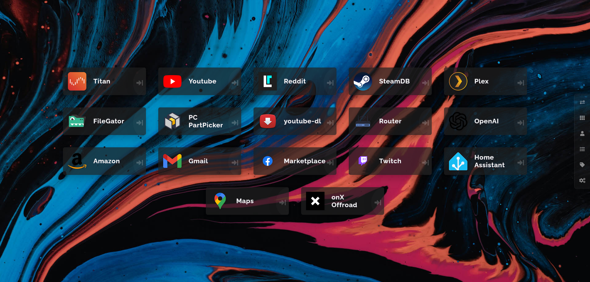

	

# Heimdall Theme

A nice dark theme for your Heimdall dashboard.

## Installation

1. Copy contents of [style.css](https://github.com/Recondroid/Heimdall-Catppuccin-Theme/blob/master/style.css) file, then paste it into your Heimdall in Settings -> Custom CSS.
2. _(Optional)_ Download [wallpaper.jpg](https://github.com/Recondroid/Heimdall-Catppuccin-Theme/blob/master/wallpaper.jpg) file, then set it as your Heimdall background in Settings -> Background Image. Also you can use any other wallpaper as the background that matches catppuccin color palette.

[Background Credit](https://unsplash.com/photos/blue-white-and-red-abstract-painting-NTYYL9Eb9y8)
